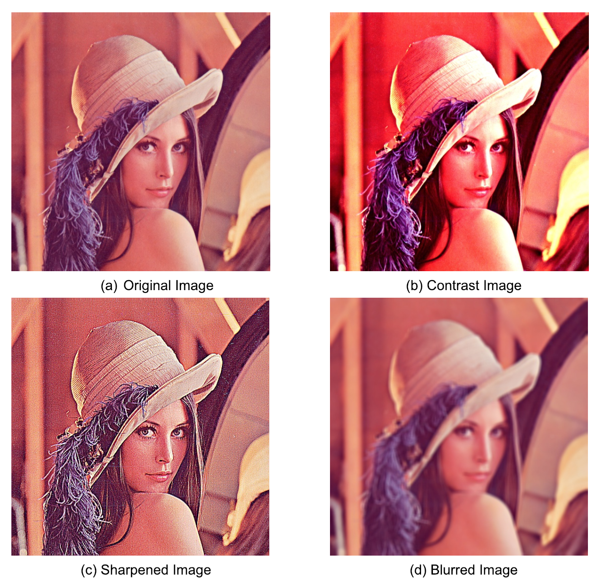
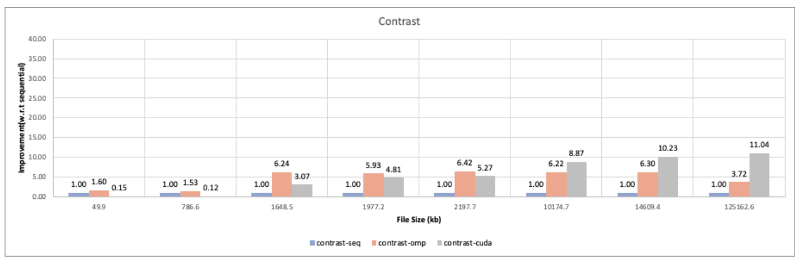
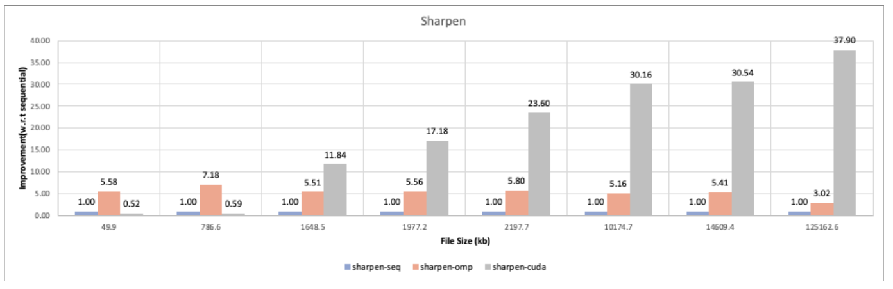
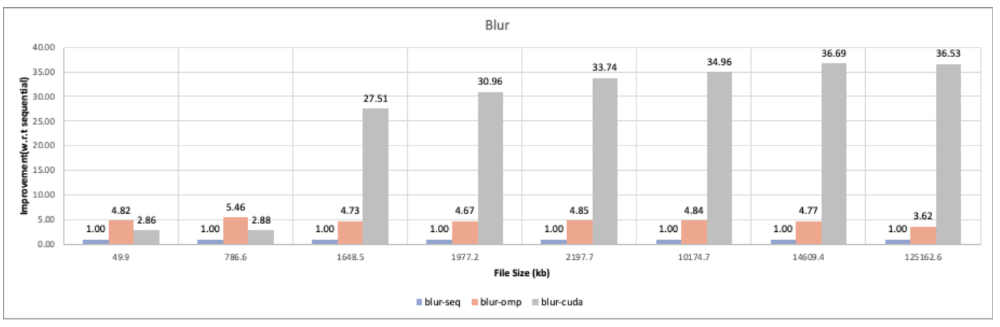
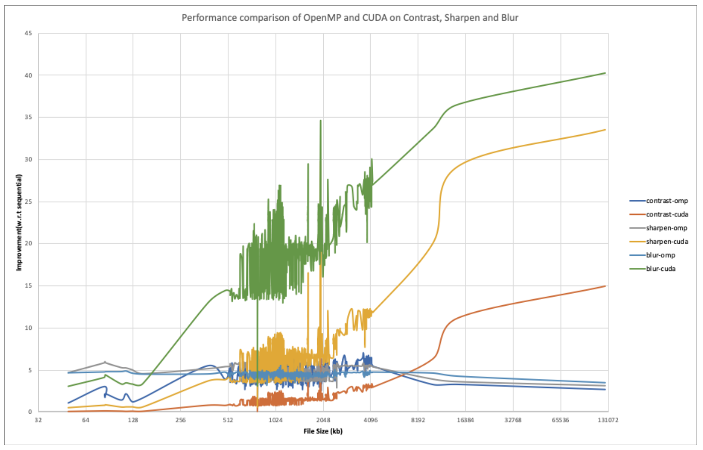
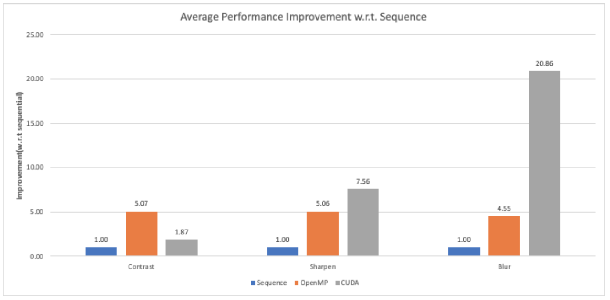

# CMPE-275-Project2: Image Processing using OpenMP and CUDA

## Installation Guide:

1. Install gcc-8 `https://gcc.gnu.org/gcc-8/`
2. Install opencv 2.4.8 `https://opencv.org/opencv-2-4-8.html`
3. Install Cuda on Nvidia cuda supported GPUs (Will require you to install Nvidia driver) `https://developer.nvidia.com/cuda-downloads`
    * Download CUDA 10.0 Toolkit's  "runfile (local)"
    * Remove any other installation (sudo apt-get purge nvidia-cuda* - if you want to install the drivers too, then sudo apt-get purge nvidia-*.)
    * If you want to install the display drivers(*), logout from your GUI. Go to a terminal session (ctrl+alt+F2)
    * Stop lightdm: sudo service lightdm stop
    * Create a file at /etc/modprobe.d/blacklist-nouveau.conf with the following contents: blacklist nouveau
    * options nouveau modeset=0
    * Then do: sudo update-initramfs -u
    * sudo sh cuda_10.0_linux.run --override
    * Start lightdm again: sudo service lightdm start
4. Make sure `cmake` utility is installed on your system

## Setup Guide

1. Generate make cmake files

```
make cmake
```

2. Generate binary for all the algorithms

```
make compile
```
It will generate 9 executables in `./bin/` directory.

3. Run any binary

```
./bin/contrast-seq <image_path>
```
For example:
```
./bin/contrast-seq ./images/lena_std.tif
```

## Output



## Results






